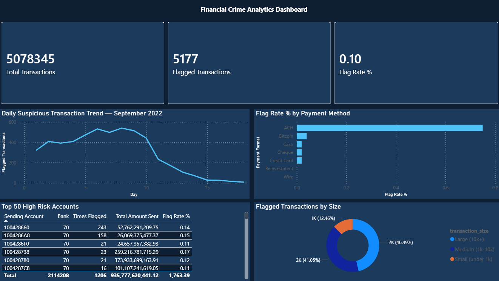

# Financial Crime Analytics Dashboard
### SQL · Power BI · Anti-Money Laundering Analysis

## Overview
Analysed 5+ million financial transactions from the IBM AML dataset using SQL and Power BI to identify money laundering patterns, high-risk accounts, and suspicious payment behaviours. Built as a portfolio project simulating a real-world fintech fraud monitoring workflow.

## Tools Used
- **SQL (SQLite / DBeaver)** — data extraction and analysis
- **Power BI** — interactive dashboard and visualisation

## Business Questions Answered
- What percentage of transactions are flagged as suspicious?
- Which payment methods carry the highest laundering risk?
- Which accounts are responsible for the most flagged activity?
- How does suspicious activity fluctuate day to day?
- Which currencies are most associated with laundering?
- Do large transactions carry higher fraud risk than small ones?

## Key Findings
- Only **0.10%** of 5 million transactions were flagged illustrating the needle-in-a-haystack challenge of AML detection
- **ACH payments account for 87% of all flagged transactions** despite having a low individual flag rate of 0.75%
- Two distinct criminal profiles identified: high-volume accounts hiding in plain sight vs low-volume accounts with 90%+ flag rates
- **Large transactions (10k+) are 6x more likely to be flagged** than small transactions, but small transactions show structuring behaviour
- Suspicious activity peaked around day 7–10 of September 2022 then dropped sharply after day 15
- Contrary to expectations, cross-currency transactions were not the primary laundering vector, same-currency ACH dominated

## Dashboard
The Power BI dashboard includes:
- 3 KPI cards — Total Transactions, Flagged Transactions, Overall Flag Rate
- Daily trend line chart of suspicious activity
- Horizontal bar chart of flag rate by payment method
- Top 50 high risk accounts table
- Donut chart of flagged transactions by size

## Dataset
IBM Transactions for Anti-Money Laundering (AML) — publicly available on Kaggle
- 5,078,345 transactions
- September 2022
- 7 payment formats across multiple currencies
